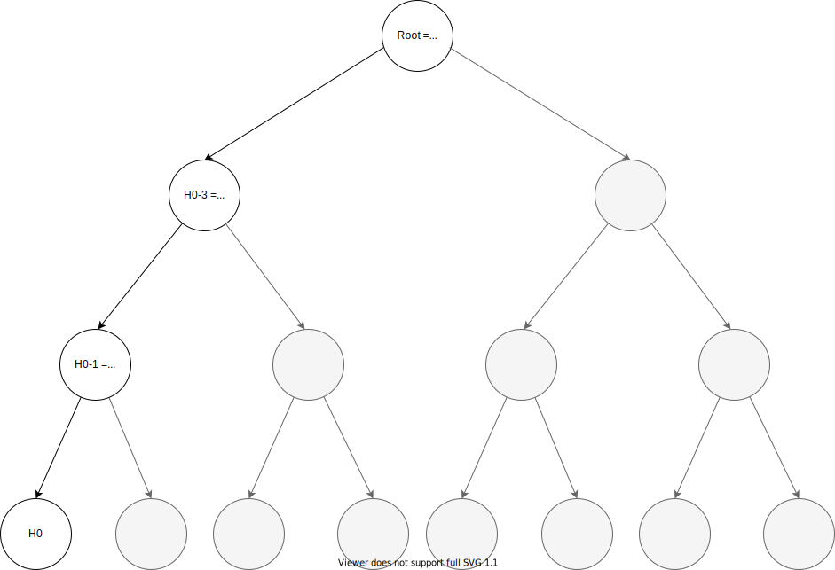
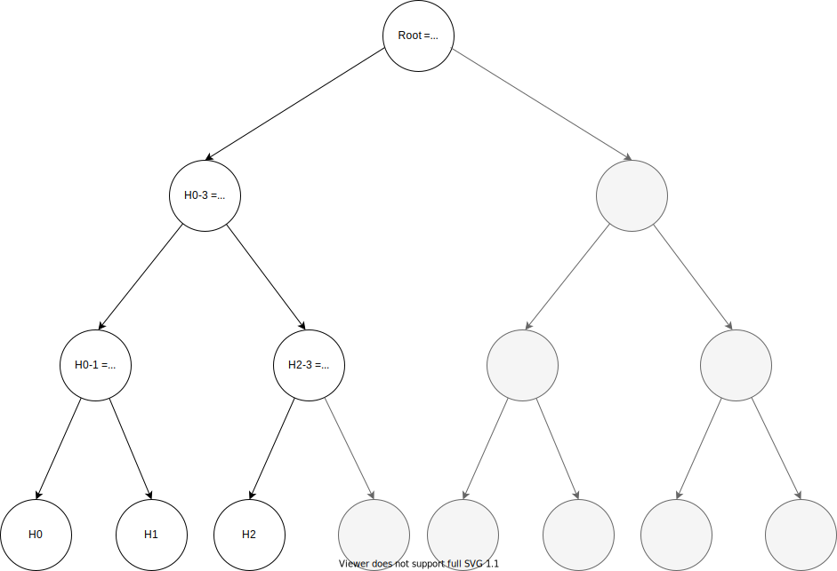
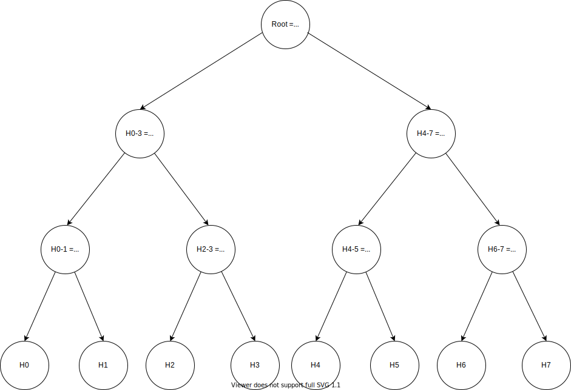

# Merkle Trees

Link to Solution in the dev portal: [post](https://developer.algorand.org/solutions/committing-to-large-datasets-using-merkle-trees-in-pyteal/)

## Requirements
Install requirements.txt
```
pip install -r requirements.txt
```

## Usage
Generate the TEAL scripts:
```
python teal.py
```

Create the app using goal:
```
goal app create --creator $CREATOR_ADDRESS --approval-prog ./mt_approval5.teal --global-byteslices 1 --global-ints 1 --local-byteslices 0 --local-ints 0 --clear-prog ./mt_clear.teal
```
This will create the stateful app with 1 global `byte slices` and 1 global `int`

### Changing tree height

In order to change the tree height you'll need to change the `TREE_HEIGHT` variable in `teal.py`

## Merkle tree helper tool

In this repo you'll also find `merkle_tree.py` which helps you generate the arguments for the app calls.

In order to use the tool, you'll need to create an instance of the `MerkleTree` object with the desired height.

`MerkleTree` has 3 methods:

- **append** - appends the given value to the merkle tree and returns a string of app args for the stateful TEAL `append` app call. 
- **verify** - finds the given value in the merkle tree and returns a string of app args for the stateful TEAL `verify` app call.
- **update** - finds the given old value in the merkle tree, replaces it with the given new value and returns a string of app args for the stateful TEAL `update` app call.


An example of use is available in `example_mt_tool.py`

## Test
First, generate the TEAL scripts.

Then, run:
```
./test.sh $CREATOR_ADDRESS
```
to run some simple tests that creates the app and appends and verifies 8 time (record0,...,record7).

- `CREATOR_ADDRESS` - account to create the stateful TEAL

Make sure `CREATOR_ADDRESS` is funded to meet the minimum balance constraint.

## Visualization

In the next section we'll try to visualize the structure of our implementation.

We'll be looking on a tree of height 2, with maximum of 4 records.

`0` denotes an empty byte array

`+` denotes concatenation

#### Init
Starting with an empty tree:


At the beginning each leaf is the output of `SHA256` of an empty byte array.

#### First record
First record is added, meaning its hash is stored in the leftmost leaf and all nodes on the path to root are updated:
1. **Hash 0-0** is updated to be the output of `SHA256` of `record0`.
2. **Hash 0** is updated to be the output of `SHA256` of the concatenation of the new **Hash 0-0** and **Hash 0-1** (the output of `SHA256` of an empty byte array).
3. **Root** is updated to be the output of `SHA256` of the concatenation of the new **Hash 0** and **Hash 1** (unchanged).

Again, each leaf with no value is the output of `SHA256` of an empty byte array.



#### Second record
Second record is added. Now **Hash 0-1** is updated to be the output of `SHA256` of `record1`,
and all nodes on the path to root are updated (**Hash 0-1**, **Hash 0** and **Root**).


#### Third record
Third record is added. **Hash 1-0** is updated to be the output of `SHA256` of `record1`.
Again all nodes on the path to root are updated (**Hash 1-0**, **Hash 1** and **Root**).



#### Full tree

