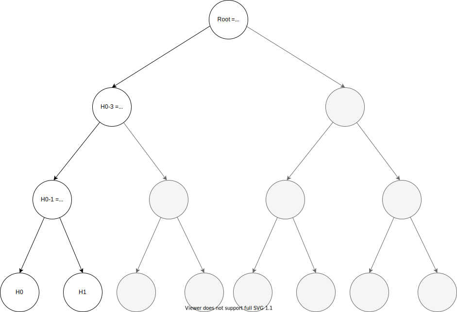

# Merkle Trees
## Requirements
Install requirements.txt
```
pip install -r requirements.txt
```

This app is using `ScratchVar` from pyteal which is not supported yet on latest release (v0.6.1).

This means cloning [pyteal](https://github.com/algorand/pyteal) repo is needed:
```
git clone git@github.com:algorand/pyteal.git
cd pyteal
pip install .
```

Note that this is tested with commit `120202cf73b43612426a054d5b731320d13bfdf1`

## Usage
First you'll need to export `MT_ALGOD_URL` and `MT_ALGOD_TOKEN` environment variables to match a valid v2 algod client.

Then, to generate the TEAL scripts run:
```
python teal.py
```

Create the app using goal:
```
goal app create --creator $CREATOR_ADDRESS --approval-prog ./mt_approval.teal --global-byteslices 2 --global-ints 1 --local-byteslices 0 --local-ints 0 --clear-prog ./mt_clear.teal
```
This will create the stateful app with 2 global `byte slices` and 1 global `int`

***You'll need to fund the stateless smart contract account in order to meet the minimum balance.**

Then you'll need to create groups of 3 transactions where:
- The 1st transaction is the app call
- The 2nd is paying the fee to the smart contract
- The 3rd is the stateless teal call

### Changing tree height

In order to change the tree height you'll need to change the `TREE_HEIGHT` variable in `teal.py`

### App args schematics

This implementation supports 2 actions: `append` and `validate`.

Both actions expect the same number of app args.
We'll assume 7 app args in the next demonstration (tree height = 3, maximum 8 records)

#### Append
app-arg #0: `str:append` stating the wanted action.

app-arg #1: `b64:$CURRENT_ROOT` the `base64` encoding the current root before appending

app-arg #2: `b64:$NEW_ROOT` the `base64` encoding the new root after appending

app-arg #3: `str:$VALUE` the string representation of the value to append

app-arg #4: `b64:$FIRST_SIBLING_HASH` the `base64` encoding of the `sha256` of the first sibling.

app-arg #5: `b64:$SECOND_SIBLING_HASH` the `base64` encoding of the `sha256` of the second sibling.

app-arg #6: `b64:$THIRD_SIBLING_HASH` the `base64` encoding of the `sha256` of the third sibling.

Note that empty leaf sibling and subtree siblings with only empty leaves should be passed as empty byte slices.

Non-empty siblings should also include a first byte stating if it's a right (0xaa) or left (0xbb) sibling.

#### Validate
app-arg #0: `str:validate` stating the wanted action.

app-arg #1: `b64:$CURRENT_ROOT` the `base64` encoding the current root before appending

app-arg #2: `b64:` ignored for this action, since this is a read-only action

app-arg #3: `str:$VALUE` the string representation of the value to validate

app-arg #4: `b64:$FIRST_SIBLING_HASH` the `base64` encoding of the `sha256` of the first sibling.

app-arg #5: `b64:$SECOND_SIBLING_HASH` the `base64` encoding of the `sha256` of the second sibling.

app-arg #6: `b64:$THIRD_SIBLING_HASH` the `base64` encoding of the `sha256` of the third sibling.

Note that empty leaf sibling and subtree siblings with only empty leaves should be passed as empty byte slices.

Non-empty siblings should also include a first byte stating if it's a right (0xaa) or left (0xbb) sibling.

## Merkle tree helper tool

In this repo you'll also find `merkle_tree.py` which helps you generate the arguments for the app calls.

In order to use the tool, you'll need to create an instance of the `MerkleTree` object with the desired height.

`MerkleTree` has 2 methods:

- **append** - appends the given value to the merkle tree and returns a string of app args for the stateful TEAL `append` app call. 
- **validate** - finds the given value in the merkle tree and returns a string of app args for the stateful TEAL `validate` app call.

An example of use is available in `example_mt_tool.py`

## Test
First, generate the TEAL scripts.

Then, run:
```
./test.sh $CREATOR_ADDRESS $SMART_CONTRACT_ADDRESS
```
to run some simple tests that creates the app and appends and validates 8 time (record0,...,record7).

- `CREATOR_ADDRESS` - account to create the stateful TEAL

- `SMART_CONTRACT_ADDRESS` - the stateless smart contract address

Make sure `CREATOR_ADDRESS` and `SMART_CONTRACT_ADDRESS` are funded to meet the minimum balance constraint.

## Visualization

In the next section we'll try to visualize the structure of our implementation.

We'll be looking on a tree of height 3, with maximum of 8 records.

`0` denotes an empty byte array

`|` denotes concatenation

<code>H<sub>i</sub></code> denotes the `SHA256` of `Record #i`

#### Init
Starting with an empty tree, root value is an empty byte array:


#### First record
First record is added, meaning its hash is stored in the leftmost leaf.
Each leaf with no value and each non-leaf with only empty leaves in its subtree is considered as `0`.


#### Second record
Second record is added. Now <code>H<sub>0-1</sub></code> is the `SHA256` of the concatenation of <code>H<sub>0</sub></code> and <code>H<sub>1</sub></code>,
and all nodes on the path to root are updated.


#### Third record
Third record is added. <code>H<sub>2-3</sub></code> is revealed and is no longer considered as `0`.
Again all nodes on the path to root are updated.


#### Full tree
